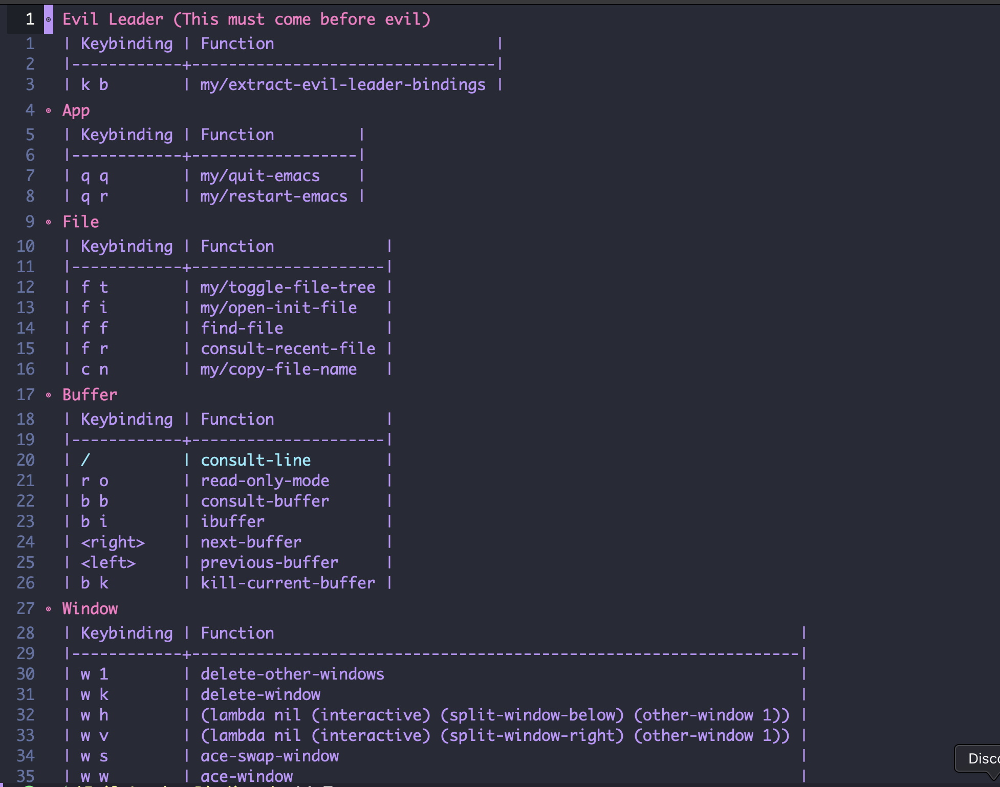

# Org Mode View for Evil Leader Keybindings

An Emacs Lisp utility that parses an Org-mode configuration file (like `config.org`) to extract `evil-leader/set-key` definitions. It automatically groups the discovered keybindings by their respective top-level Org headings and outputs them into cleanly formatted Org tables in a dedicated buffer.

## 📸 Preview

<p align="center">
   
</p>

## 🚀 Example Uages

```emacs-lisp
(load-file (expand-file-name "lisp/evil-keybinding-extractor.el" user-emacs-directory))

(setq my/config-file-location "~/.emacs.d/config.org")

(evil-leader/set-key
  "k b" 'my/extract-evil-leader-bindings)
```
